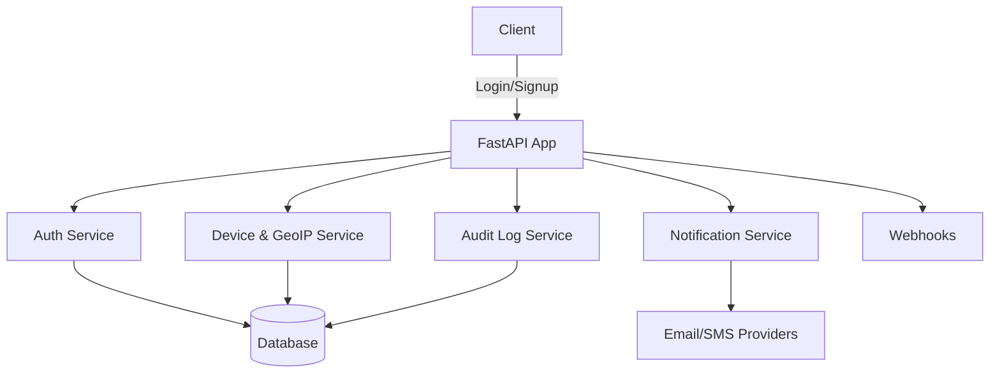

# FastAPI Authentication System

## Overview

This project is a robust, production-ready authentication and authorization system built with FastAPI. It supports modern security features such as JWT, OAuth2, 2FA (TOTP, SMS, Email), device fingerprinting, geo-location tracking, audit logging, country blacklisting with history tracking, and role-based access control (RBAC). The system is modular and extensible, suitable for integration into any FastAPI application. It is designed for both individual projects and organizations that require advanced security and compliance.

### Custom & Secondary Roles (RBAC)

The system supports both primary and secondary roles for users. While the primary role (e.g., user, admin, superadmin) determines the main access level, secondary roles allow for custom, fine-grained permissions and organizational policies. This enables features such as:

- Assigning multiple roles to a user (e.g., `user` + `auditor`, or `admin` + `support`)
- Defining custom roles and scopes for organizations or teams
- Dynamic permission checks based on both primary and secondary roles
- Organization-level role management and dynamic permission assignment

## Features

- **JWT Authentication**: Secure, stateless authentication using JSON Web Tokens for API access.
- **OAuth2 Support**: Social login and third-party authentication (Google, Facebook, etc).
- **Multi-Factor Authentication (MFA)**: TOTP (Google Authenticator), SMS OTP, and Email OTP for enhanced security.
- **Device & Location Tracking**: Detects suspicious logins using device fingerprinting and multi-source geo-location tracking (MaxMind, IP-API, IPAPI.co, IPWho.is).
- **Country Blacklisting**: Block or restrict access from specific countries with admin controls, audit history, and multiple fallback location providers.
- **Account Lockout**: Automated account protection against brute-force attacks with configurable thresholds.
- **Audit Logging**: Logs all critical actions (login, logout, password change, etc.) to both database and file for traceability.
- **Role-Based Access Control (RBAC)**: Fine-grained permissions for users, admins, and organizations. Supports custom and secondary roles (multi-role assignment, custom scopes, and future organization-level policies).
- **Magic Link Login**: Passwordless authentication via secure email links.
- **Webhooks**: Notifies external services of user events (signup, deletion, password reset, etc).
- **Notifications**: Email and SMS notifications for critical events (new device, password change, suspicious login, etc).
- **Session & Token Management**: Tracks refresh tokens, temporary tokens, and device sessions for secure session handling.
- **Admin Features**: User activation/deactivation, banning, audit log review, and more.

## System Architecture



## Implemented Features

- **Authentication Methods**:

  - TOTP (Time-based One-Time Password) with QR code setup
  - SMS OTPs with configurable providers
  - Email OTPs for suspicious login detection
  - Password-based authentication with secure hashing
  - Magic Link authentication via secure email
  - OAuth2 login (Google, Facebook and GitHub)
  - Refresh token tracking with device fingerprinting
  - Service app authentication with API keys and scopes

- **Security Features**:
  - Multi-provider geolocation (MaxMind, IP-API, IPAPI.co, IPWho.is)
  - Country blacklisting with:
    - Admin controls for blocking/unblocking countries
    - Detailed audit history of changes
    - Multiple fallback location providers
    - Automatic IP address validation
  - Comprehensive audit logging (file and database)
  - Device fingerprinting and suspicious login detection
  - Webhook notifications for critical events
  - Secondary/custom roles system with:
    - Organization-level role management
    - Dynamic permission assignment
    - Custom role hierarchies
    - Flexible scope definitions
- **User Management**:
  - Account activation and deactivation
  - Account banning and unbanning with history
  - Account status tracking and auditing
- **Service App Authentication**:
  - API key generation and management
  - Granular scope-based access control
  - Rate limiting and usage tracking
  - Automatic key rotation support

## Planned & Incomplete Features

- Redis for OTP storage (improved scalability and speed)
- Push-based MFA (e.g., mobile app push notifications)
- Face recognition for biometric authentication
- Enhanced RBAC policies and permissions caching
- Context-aware access (device, IP, time-of-day, geo-location, behavioral analysis)
- Custom verification system for external and internal services
- Improved webhook reliability, retry, and dead-letter queue
- Notification enhancements (in-app, push, multi-channel)
- Enhanced magic link features (expiration policies, usage tracking)
- Improved suspicious login detection

## Quick Start

1. **Clone the repository**
   ```bash
   git clone https://github.com/Adeleye080/Authentication-System.git
   cd Authentication-System
   ```
2. **Install dependencies**
   ```bash
   poetry install
   ```
3. **Configure environment**
   - Copy `.env.example` to `.env` and update values as needed.
4. **Run database migrations**
   ```bash
   alembic upgrade head
   ```
5. **Start the application**
   ```bash
   uvicorn main:app --reload
   ```
6. **Access documentation**
   - Visit [http://localhost:8000/documentation](http://localhost:8000/documentation)

## Roles & Permissions System

The authentication system is designed to support both standard and custom roles. Each user can have a primary role (such as `user`, `admin`, or `superadmin`) and one or more secondary roles. This allows for:

- Flexible permission assignment (e.g., a user can be both a `moderator` and a `support` agent)
- Organization-specific roles and policies
- Future support for dynamic, per-endpoint permission checks

**Example (planned):**

```json
{
  "user_id": 123,
  "primary_role": "admin",
  "secondary_roles": ["auditor", "support"]
}
```

The codebase already includes the foundation for secondary/custom roles, and future updates will provide admin APIs for managing roles, scopes, and permissions at both the user and organization level.

The project is organized for clarity and scalability. Key directories and files:

```
.
├── main.py                # FastAPI entrypoint
├── api/                   # API versioned modules
│   ├── v1/
│   │   ├── models/        # SQLAlchemy models
│   │   ├── routes/        # API routes
│   │   ├── schemas/       # Pydantic schemas
│   │   ├── services/      # Business logic
│   ├── core/              # Core utilities and base classes
│   ├── utils/             # Utility functions (encryption, validation, etc)
├── db/                    # Database connection and setup
├── migrations/            # Alembic migrations
├── smtp/                  # Email sending and templates
├── geoip/                 # GeoIP database
├── tests/                 # Test scripts
├── app_logs/              # Log files
├── docker-compose.yml     # Docker setup
├── pyproject.toml         # Poetry config
├── README.md
```

## Security & Best Practices

- All sensitive operations are logged and auditable (file and database).
- Device, IP, and geo-location checks for suspicious logins.
- Country blacklisting for regulatory compliance and security.
- Account lockout after repeated failed attempts (brute-force protection).
- All tokens (JWT, refresh, magic link, OTP) are securely generated and stored.
- Webhooks and notifications for all critical user events.
- Secure password hashing and encryption (bcrypt, passlib, cryptography).
- Environment-based configuration for secrets and sensitive data.

## Contributing

Contributions are welcome! Please open issues or submit pull requests for improvements, bug fixes, or new features. For major changes, please open an issue first to discuss what you would like to change.

### Ways to Contribute

- Report bugs or request features via GitHub Issues
- Submit pull requests for code, documentation, or tests
- Help improve security, performance, or usability

## License

ISC License. See [LICENSE](LICENSE) for details.

## Author

Ajiboye Adeleye Pius  
<ajiboyeadeleye080@gmail.com>
